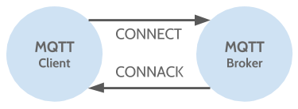
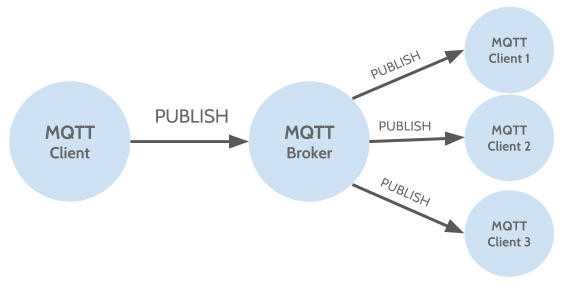
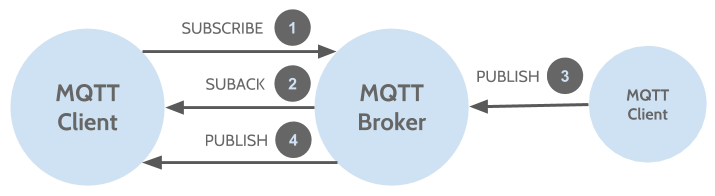

## MQTT - Concepts & Usage

The last part of this serie of posts about MQTT will cover some concepts about the protocol that essentialy will show us the boundaries of the protocol and how it handles the connections between clients and the broker.

### Connection
             
Let's start by defining the **MQTT Connection**. The connection initiates when a client sends a *CONNECT* message to the broker, then the broker responds with a *CONNACK* and a status code.


               
Once the connections is established the broker will keep the connection until the client send a disconnect command or it losses the connection.
            
The **CONNECT** message include some information relative to an implementer of a MQTT library than the users that will use the library, here I'll present to you the basic information relevant for the users.

* **clientId**                                          
  The *clientId* is an identifier for each MQTT Client, this means that should be unique for each client connected to the broker indicating that it must keep the state for that client. Since MQTT version 3.1.1, it is possible to connect without a clientId so the broker won't keep the state.
  If you use clientId you should set cleanSession to true, otherwise the connection will be refused.
* **cleanSession**                                       
  The *cleanSession* flag indicates to the broker whether the client wants to establish a persistent session or not. If cleanSession is set to false, it means that the broker will stores all the subscriptions of the client as well as all the messages that do not arrived to the client as long as the QoS has been defined as 1 o 2. If cleanSession is set to true, the broker won't store anything for the client, non the subscriptions neither the missed messages.
* **username/password** (optional)                                   
  The *username* and *password* are used for authentication and authorization. It is recommended to encrypt the password. 
* **keepAlive**                                 
  The *keepAlive* is a time interval, the clients commits to by sending regular PING Request messages to the broker. The broker response with PING Response and this mechanism will allow both sides to determine if the other one is still alive and reachable.

When the broker obtains the CONNECT it responds with a **CONNACK** message that only contains two data entries.

* **sessionPresent**                                    
  This flag indicates to the client wheter the broker has a persistent session or not. If the client in a previous connection set the cleanSession to false then this flag is true, otherwise is false.
* **returnCode**                                                     
  This flags lets the client know if the connection attemp was successfull or not, and if not, it indicates what the issue is.

### Publish
The publish action allows a client to send messages to a topic destination in different modes, but always with a payload, and due MQTT is a data agnostic, you can set to the payload the *data* you want for the case you need. The publish message have some attributes, listed bellow the most important:

* **Topic Name**, the name of the topic destination to publish in the broker
* **QoS**, the "Quality of Service" in which you want to send a message. It is used to define the 
  guarantee of a message. The possible values are 0, 1 or 2. See more about the QoS in the next section.
* **Retain Flag**, this flag instructs the broker to retain the *last* message sent for those new subscribers in order to receive the retained message in a new conenction to the broker. This could be usefull if you have a notification for new subscribers.
* **Payload**, is the content of the message. As commented before MQTT is data agnostic so you can send any kind of message (image, binary, text).
* **Packed ID**, is a unique identifier between the client and brokre that identifies the message during the message flow.
* **Dup Flag**, indicates that a message is duplicate because the last message sent was not acknowledged, so the message will be resent. This flag is taking in account when QoS 1 or 2.

Each publisher is responsible of the send of the message to the broker, once the broker receives the message it is now responsible to publish the message to the subscribers.



Here the code of a MQTT Client - Publisher using the Paho API
```java
MqttClient samplePublisher = null;
try {
    // set default memory persistence in case QoS is 1 or 2
    MemoryPersistence persistence = new MemoryPersistence();
    // create new MQTT Client using URI, CLientID and persistence
    samplePublisher = new MqttClient(getUri(), getClientId(), persistence);
    // create MQTT Options to set the connection attributes
    MqttConnectOptions options = new MqttConnectOptions();
    // default cleanSession is set to true to indicate the broker to don't keep session
    // change to false if you want the broke keep a session
    options.setCleanSession(true);
    logger.info("Connecting to: {}", getUri());
    // establish a connection 
    // a CONNECT is sent and the broker should respond with a CONNACK
    samplePublisher.connect(options);
    
    // create new MQTT message
    MqttMessage message = new MqttMessage();
    // the payload is the content of a message 
    message.setPayload(getPayload().getBytes());
    logger.info("Publishing message {} to {} topic", getPayload(), getTopic());
    // publish the message to the Topic indicated
    samplePublisher.publish(getTopic(), message);
    logger.info("Message sent, disconnecting client");
    // disconnect
    samplePublisher.disconnect();
    
} catch (MqttException e) {
    // handle exception
    logger.error("Error while publishing");
    logger.error("Reason ", e.getReasonCode());
    logger.error("Message ", e.getMessage());
    logger.error("Localized Message ", e.getLocalizedMessage());
    logger.error("Cause ", e.getCause());
    logger.error("Exception ", e);
    logger.error("StackTrace", (Object[])e.getStackTrace());
}
```
[Complete code](https://goo.gl/dJBp8R "MarceStarlet Github - MQTTPahoPublisher")

### Subscribe
A subscription is when a MQTT client susbcribes to a Topic in a Broker with a specific QoS, in order to receive the messages that a puslisher send to the topic where is subscribed. A subscription consists of a **SUBSCRIBE** message that has a packed identifier and a list of subscriptions as attributes.

* **Packed ID**, is a unique identifier between the client and brokre that identifies the message during the message flow.
* **List of Subscriptions**, contains an indetermined subscriptions that are formed of Topic and QoS pairs. The Topic attribute could be a wildcard that makes the client able to subscribe to some topic patterns.

Then, the broker responds with a **SUBACK** message that has the same Packed Identifiers as the SUBSCRIBE message and a list of return codes.
                                                 
The SUBACK contains a return code per each subscription in the SUBSCRIBE message. When a topic is overlapped, then the highest QoS is taken for the delivering of the message.



Here the code of a MQTT Client - Subscriber using the Paho API
```java
// the class must implement MqttCallback

MqttClient sampleSubscriber = null;
try {
    // set default memory persistence in case QoS is 1 or 2
    MemoryPersistence persistence = new MemoryPersistence();
    // create new MQTT Client using URI, CLientID and persistence
    sampleSubscriber = new MqttClient(getUri(), getClientId(), persistence);
    // create MQTT Options to set the connection attributes
    MqttConnectOptions options = new MqttConnectOptions();
    // default cleanSession is set to true to indicate the broker to don't keep session
    // change to false if you want the broke keep a session
    options.setCleanSession(true);
    // set 30 sec of keepAlive
    options.setKeepAliveInterval(30);
    
    logger.info("Connecting to: {}", getUri());
    // establish a connection 
    // a CONNECT is sent and the broker should respond with a CONNACK
    sampleSubscriber.connect(options);
    // set an asynchronous receive
    sampleSubscriber.setCallback(this);
    
    // subscribe to the Topic and QoS indicated 
    sampleSubscriber.subscribe(getTopic(), getQos());
    logger.info("Subscribed and waiting ...");
    
} catch (MqttException e) {
    // handle exception
    logger.error("Error while susbcribing");
    logger.error("Reason ", e.getReasonCode());
    logger.error("Message ", e.getMessage());
    logger.error("Localized Message ", e.getLocalizedMessage());
    logger.error("Cause ", e.getCause());
    logger.error("Exception ", e);
    logger.error("StackTrace", (Object[])e.getStackTrace());
} 

@Override
public void messageArrived(String topic, MqttMessage message)
        throws Exception {
    logger.info("Message arrived: {}", new String(message.getPayload()));	
}
```
[Complete code](https://goo.gl/11nddj "MarceStarlet Github - MQTTPahoSubscriber")