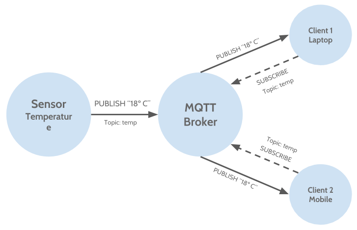

## MQTT - The protocol

Now that you know the reason of the existence of MQTT and where to use it, you can learn how it works and then how to use it.

> My philosophy: Only when we know the reason of why a technology exists and where we can apply it, the technology becomes real, otherwise does not exists.

Now some context, take it from Wikipedia the definition of protocol:
In telecommunications, a communications protocol is a system of rules that allow two or more entities of a communications system to transmit information via any kind of variation of a physical quantity. These are the rules or standard that defines the syntax, semantics and synchronization of communication and possible error recovery methods. Protocols may be implemented by hardware, software, or a combination of both.

The MQTT protocol is based on top of TCP/IP and both client and *broker need* to have a TCP/IP stack.

## MQTT Elements

*	**Publish/Subscriber**
*	**Client**
*	**Broker (Server)**

### Publish/Subscriber

The publish/subscribe pattern (pub/sub) is an alternative to the traditional client-server model, where a client communicates directly with an endpoint. However, **Pub/Sub decouples a client, who is sending a particular message (called publisher) from another client (or more clients), who is receiving the message (called subscriber)**. This means that the publisher and subscriber don’t know about the existence of one another. There is a third component, called broker, which is known by both the publisher and subscriber, which filters all incoming messages and distributes them accordingly. 

Advantages of this pattern:

*	**Decoupling of the clients**, publishers and receivers, do not need to know about each others, do not need to be running at the same time, and the operations on both components do not affect the other. 
*	**Message filtering** is the ability that pub/sub defines so the receivers do only receive the messages they are interested in.
*	**Scalability**. Can be highly parallelized and processed event-driven.

**MQTT takes advantages of all of these characterístics of the pub/sub pattern.**

*This fragment was taken from the HiveMQ MQTT blog documentation* [HiveMQ Pub/Sub](http://www.hivemq.com/blog/mqtt-essentials-part2-publish-subscribe "hivemq").

### Client

As we have explained in the previous section we can infer that a client can be both a publisher or a subscriber acting under the different purposes they have, or be both at the same time. A publisher is the client destined to accomplish the task of send messages to the MQTT Broker, so then, the subscriber is charged to subscribe to the broker and receive the messages that is interested in. 

Therefore, a client is any device using the MQTT library and executes the corresponding to connect to a MQTT broker, through a network.

The MQTT protocol has many library implementations in most of the programming languages such as Java, Android, Arduino, C, C++, C#, Go, iOS, JavaScript, .NET.

### Broker
The Broker is the heart of the protocol, it is the component that makes the protocol real. The Broker is in charge of establish connections with all clients, receive all the messages, filter and deliver them to the corresponding interested subscribers. Besides, it persists the messages needed, keeps sessions with the clients, security by supporting authorization and authentication, etc. As it is responsible of communication between clients it must support failover scenarios to recover itself, should be scalable as well as easy to integrate in backend systems.    
    
The Clients connect to the Broker and the broker connects the clients each other.
   
Some Brokers that implements MQTT are:   

*  ActiveMQ
*  Apache Apollo
*  HiveMQ
*  Mosquitto
*  Moquette
*  RabbitMQ   
   
*  WebSpehreMQ
*  JBoss A-MQ
*  IBM Integration Bus   
   
In the Next post of the MQTT protocol I'll explain you the concepts of the protocol like: QoS, Session, Topics, Connections, MQTT Messages, etc. Also, we'll see how to use the protocol by implementing some clients that will connect to a MQTT Broker.